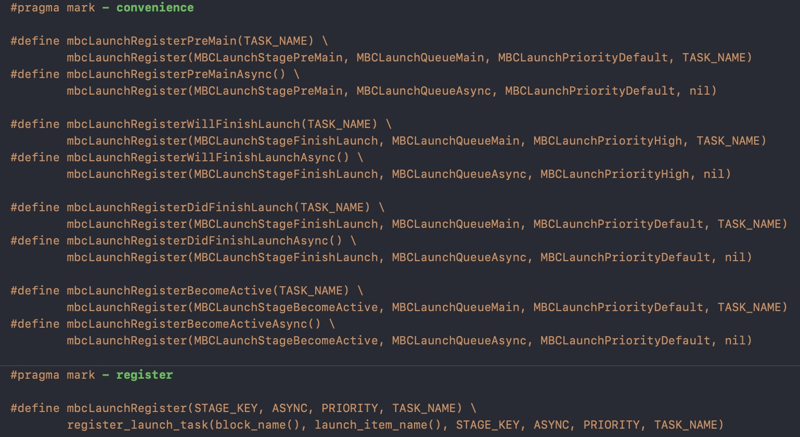
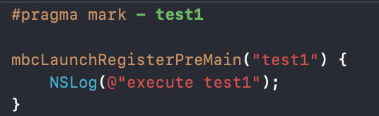
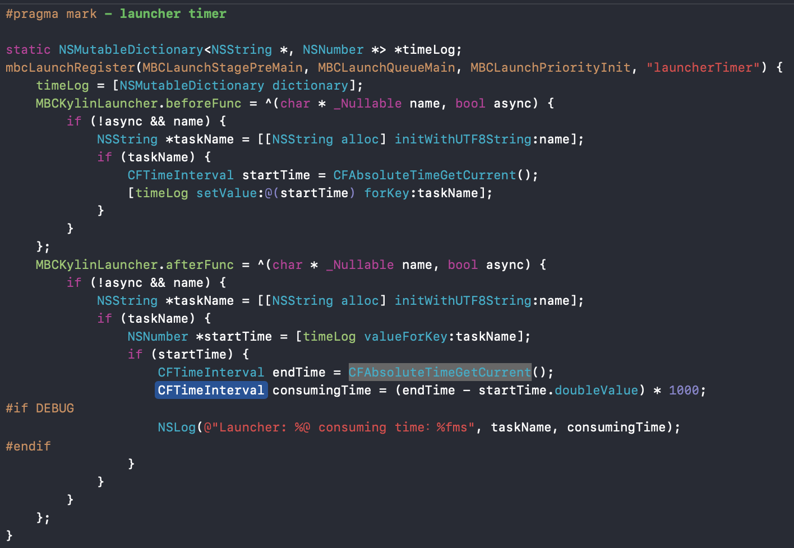
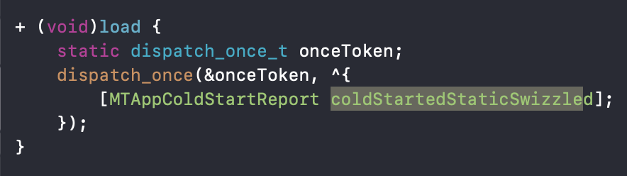
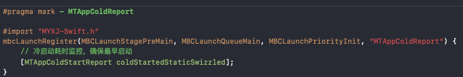
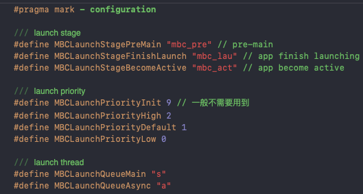
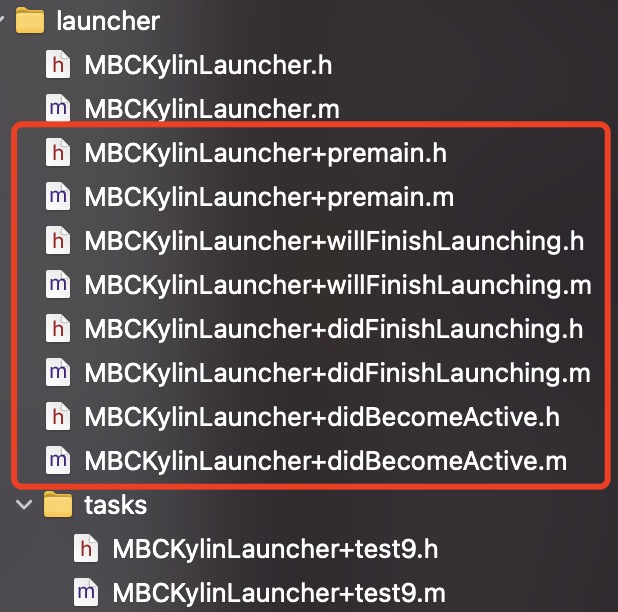
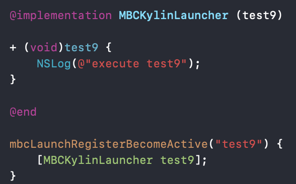

# MBCKylinLauncher
##原理

基于 [美团外卖iOS App冷启动治理](https://tech.meituan.com/2018/12/06/waimai-ios-optimizing-startup.html) 中启动自注册方案的实现

原理引用原文 “Clang 提供了很多的编译器函数，它们可以完成不同的功能。其中一种就是 section() 函数，section()函数提供了二进制段的读写能力，它可以将一些编译期就可以确定的常量写入数据段。 在具体的实现中，主要分为编译期和运行时两个部分。在编译期，编译器会将标记了 attribute((section())) 的数据写到指定的数据段中，例如写一个{key(key代表不同的启动阶段), *pointer}对到数据段。到运行时，在合适的时间节点，在根据key读取出函数指针，完成函数的调用。”

##使用
主要是调用宏：

提供了四个阶段的简易注册宏，注册主线程任务需要传入TASK_NAME用于记录耗时上报

注意这里willFinishLaunch与DidFinishLaunch其实是同一个阶段，只是优先级上的区别，因为其实正常来讲willFinish/didFinishLaunch没有太大区分/细化的必要，这里仅仅是为了保证原有启动项启动顺序。

没有特殊需求就用简易注册宏即可：

有需要再自己配置，比如这个记录启动项耗时的，需要保证最早执行：

其中premain阶段，用于替换load调用

=>

###配置
具体启动配置按app生命周期主要分为三个阶段、四种优先级、主线程/子线程

##结构

主要就按原先启动管理的阶段分了四个分类，用来归置原有的启动子项

这里其实不是必须用分类，只创建个.h文件引入后也可以完成注册，但为了代码规范还是考虑使用分类，再则是可以添加方法调用：

###至于代码写在哪里

一些代码量比较少的可以继续写在launcher几个阶段分类中

代码量大的复杂的，可以自行创建分类

写在启动项所相关的业务类中也可以